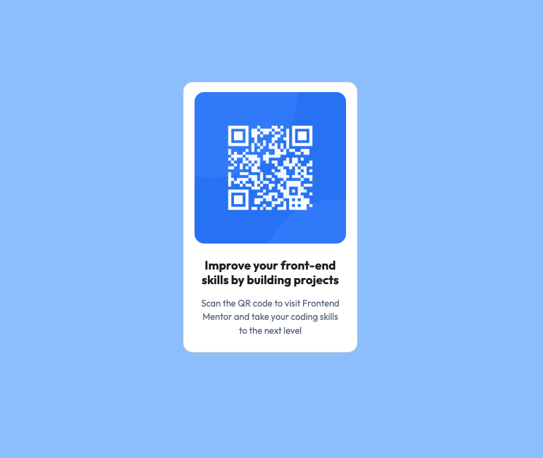

# QR Code Component using Bootstrap

### Description

This is a foundational Frontend Mentor challenge using HTML and CSS.
The project helps to practice translating Figma designs into HTML and CSS using Bootstrap.

### What I learned

1. The challenge I faced was ensuring my custom styles worked well with Bootstrap's component.
2. Using Bootstrap utility classes simplified my layout and spacing, so I could apply them quickly, while still writing some custom CSS.
3. I might choose not to use Bootstrap if the design is very custom or when I want to keep the project lightweight.

### Resources

getbootstrap.com, W3schools, MDN Web Doc and referenced AI-based tool for design suggestions.

